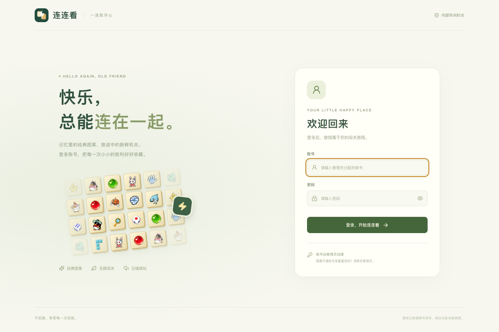

# 连连看 · 一连就开心

经典 QQ 连连看图标、闪电与音效，单人无限闯关。账号由管理员创建；当前进度和通关成绩保存在服务端 SQLite 中，网页负责游戏逻辑和效果。



[游戏界面预览](docs/previews/game-desktop.png) · [手机界面预览](docs/previews/game-mobile.png) · [经典图标总览](docs/previews/icons.png)

## 本地运行

要求 **Node.js 24 或更新版本**，使用其内置 SQLite，无需额外数据库服务。

```sh
npm install
npm run admin:create -- --username admin
npm run dev
```

创建管理员时会在终端隐藏输入密码。默认 Vite 地址是 `http://127.0.0.1:5173`；被占用时终端会显示新端口。API 默认监听 `127.0.0.1:3001`，Vite 转发 `/api` 请求。

登录管理员后，点击右上角昵称 → **用户管理** → 创建普通用户。没有开放注册接口。普通用户首次登录需修改初始密码；管理员可重置普通用户密码。

管理员忘记密码时，在服务器上运行：

```sh
npm run admin:create -- --username admin --reset-password
```

自动化环境可使用 `--password-stdin` 从标准输入传入密码，避免将密码放进命令参数。

## 游戏内容

- 51 个经典配对图标，最多两次转折，可走棋盘外圈。
- 闪电连接、端点光效、经典消除音效、背景音乐、连击积分及有限加时。
- 前十关教学，之后按十关节奏循环：经典、绕行、木箱、冰封、奖励、速度和组合挑战。
- 石块挡路；相邻配对击碎木箱、解冻冰层。提示、洗牌、定向破障每关重新补充。
- 关卡生成保留并验证完整消除序列；走入死局时免费调整棋盘。
- 重试、暂停、切换窗口自动暂停、键盘快捷键、声音设置、轻柔动画和移动端布局。
- 手机可一键全屏游玩；竖屏自动调整棋盘朝向，横屏把道具移至侧边。支持安全区和不提供原生全屏的浏览器。
- 触屏按松手位置选块，图块间隙响应最近图块，滑动与兼容点击不会重复选中。音效播放器固定数量复用，切换关卡无需重新创建。
- 每关均可继续下一关，不以星级限制进度。重力玩法留作后续扩展。

快捷键：空格暂停/继续，`H` 提示，`R` 洗牌，`B` 破障，`Esc` 暂停/关闭弹窗。

## 数据与同步

默认数据库是 `data/wire-pairs.sqlite`，可用 `DATA_DIR` 配置数据目录。数据库及本地开发凭据均不纳入 Git。

| 表 | 保存内容 |
| --- | --- |
| `users` | 账号、昵称、角色、加盐 scrypt 密码哈希、首次改密状态 |
| `sessions` | 登录令牌哈希、用户关联、过期时间 |
| `saves` | 每位用户当前完整棋盘、关卡、计时、道具、成绩、存档版本号 |
| `records` | 每次旅程的各关通关分数、星级、剩余时间、最高连击与时间戳 |

- Cookie 使用 `HttpOnly`、`SameSite=Strict`；HTTPS 部署启用 `COOKIE_SECURE=true`。密码修改或重置会撤销旧会话。
- 关键操作后自动上传，游戏中每 4 秒补充同步。通关记录落库后才允许进入下一关，避免快速切换时漏记成绩。
- 断线期间仅把待上传进度暂存到当前用户专属的浏览器缓存，联网自动重试。服务器始终保存正式记录；不是只写 localStorage。
- 两个设备使用相同旧版本写入时，服务器返回冲突，前端暂停并让玩家选择云端或本机进度，不默默覆盖。
- 刷新和跨设备恢复后，正在进行的棋盘以暂停状态打开。
- 当前服务不设公开排行榜；服务器验证存档结构、数量及权限，不重算网页内的每一步得分。
- SQLite 使用 WAL、事务和版本比较，适用于单实例部署。多实例运行应更换集中式数据库，例如 PostgreSQL。

## 构建与部署

```sh
npm run build
npm start
```

`npm start` 同时提供构建后的网页和 API，默认地址 `http://127.0.0.1:3001`。`npm run preview` 只用于前端静态预览，不包含 API；完整体验请使用 `npm start`。

可配置环境变量：

| 变量 | 默认值 | 用途 |
| --- | --- | --- |
| `DATA_DIR` | `data` | SQLite 和备份目录 |
| `API_PORT` / `PORT` | `3001` | 服务监听端口 |
| `HOST` | `127.0.0.1` | 监听地址；容器内设置 `0.0.0.0` |
| `APP_ORIGIN` | 请求的 HTTP Host | 浏览器访问的完整源地址，反向代理/HTTPS 时应明确设置，例如 `https://games.example.com` |
| `COOKIE_SECURE` | `false` | HTTPS 部署设置 `true` |

也提供 `Dockerfile` 和 `compose.yaml`。Compose 默认把服务映射到本机 `3001`，数据库保存在独立 volume：

```sh
docker compose up -d --build
docker compose exec app npm run admin:create -- --username admin
```

通过 HTTPS 反向代理部署时，设置正确的 `APP_ORIGIN` 与 `COOKIE_SECURE`，并持久化 `/app/data`。构建目录与数据库目录独立，更新网页不会替换数据库。

## 备份

```sh
npm run db:backup
```

使用 SQLite 在线备份 API，将一致性快照保存到 `data/backups/`，支持数据库正在运行时执行。可以由服务器的定时任务定期调用。恢复时先停止服务，用备份替换主数据库，清除该数据库旧的 `-wal` / `-shm` 旁路文件，再启动；请先保留恢复前的完整数据目录。

## 验证

```sh
npm test
npm run build
```

- 寻路与独立 BFS 对照 2,000 个随机障碍棋盘。
- 三组种子、498 个生成关卡的完整解序回放，以及任意顺序消除和死局恢复。
- 时间、连击、道具、重试、20 关连续推进和存档校验。
- 账号权限、首次改密、密码重置、会话撤销、数据隔离、版本冲突、历史去重、SQLite 持久化及请求校验。
- 浏览器检查登录/账号管理、实际棋盘点击、闪电、20 关推进与云端成绩、响应式布局和刷新恢复。可复跑的浏览器检查脚本位于 `scripts/browser-qa.js`，须使用专门的测试账号；每次执行最多四关。

本次验证的具体关卡与检查结果见 [浏览器验证记录](docs/browser-qa-results.json)。26 项自动测试和生产构建均通过；实际玩家对难度节奏的感受还需要试玩反馈。GitHub Actions 运行测试并构建发布 GHCR 镜像。

素材来源见 [ASSETS.md](ASSETS.md)，原始设计与后续调整见 [DESIGN.md](DESIGN.md)。

## 线上部署

公共镜像：`ghcr.io/k0ngk0ng/wire-pairs`。推送 main 时执行测试和构建；推送 `v*` Git tag 时发布同名版本、`latest` 和完整提交 SHA 的镜像。页面角落显示构建时注入的 Git tag；本地未指定 `VITE_APP_VERSION` 时显示 `dev`。生产使用版本标签锁定，例如 `v1.1.0`。

`deploy/compose.yaml` 仅从 GHCR 拉取镜像，通过 Nginx 将 HTTPS 转发至 `127.0.0.1:18181`，SQLite 持久化到 `/opt/wire-pairs/data`（UID/GID 1000）。在 `/opt/wire-pairs/.env` 设置 `RELEASE_TAG=v1.1.0` 后执行 `docker compose pull && docker compose up -d`。

Nginx 模板、Certbot webroot 初始配置及续期 reload hook 位于 `deploy/`。首次创建管理员：

```sh
cd /opt/wire-pairs
docker compose exec app npm run admin:create -- --username admin
```

构建时 `VITE_ASSET_BASE_URL=https://cdn.ichenj.com/llk/` 指定图片和音频根路径。`scripts/oss-assets.py` 从本地忽略目录 `.work/secrets` 读取 OSS 凭据并上传 `public/assets`；密钥不进入客户端、镜像、Git 或 Actions。音效使用可复用的原生媒体播放器，闪电纹理只用于绘制，不读取跨域画布像素。
